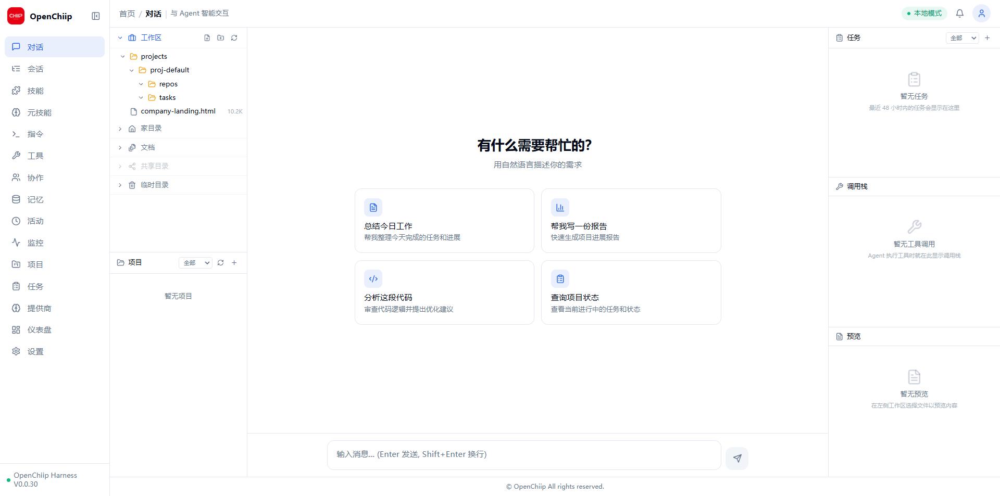

<div align="center">

#  OpenChiip Harness

### A self-hostable AI agent runtime & orchestration framework.

OpenChiip Harness is an out-of-the-box AI agent runtime that integrates **LLM conversation, skill orchestration, tool calling, multi-layer memory, multi-agent collaboration, and resource monitoring** into a single process — complete with a full React admin dashboard. Run it as a standalone local agent service, or connect it as a node to the OpenChiip platform for collaborative scheduling via outbound WebSocket (NAT traversal, no public IP required).

Whether you need a quick local agent with a UI, or a fully orchestrable, auditable, crash-resilient task execution engine, OpenChiip Harness delivers the complete package — from CLI and HTTP/WS APIs to a desktop application.

[](https://github.com/openchiip/harness)
[](LICENSE)
[](https://www.python.org/)
[]()


[openchiip.com](https://www.openchiip.com) · [中文文档](README.zh-CN.md)

</div>

<p align="center">
  
</p>

---

## Why OpenChiip Harness?

- **All-in-One Runtime** — LLM conversation, skill orchestration, tool calling, memory, monitoring, and admin UI in a single process. No microservice sprawl.

- **Three-Layer Intent Routing** — Rules → Cache → LLM, cascading through deterministic DAG execution and flexible Function Calling. Stable when you need it, adaptive when you don't.

- **Five-Primitive Capability Governance** — Skill / MetaSkill / Tool / Command / A2A, all registered through a unified CapabilityRegistry with consistent lifecycle and API exposure.

- **Multi-Provider Sub-Agents** — In-process, session-forked, or remote A2A agents. Delegate to external coding CLIs (Codex, Claude Code) for collaborative task completion.

- **Crash-Resilient Orchestration** — Decompose → Execute → Audit → Settle → Checkpoint. Event-sourced session logs enable precise replay and crash recovery.

- **Dual-Mode Operation** — Standalone mode (local FastAPI + Web UI) or Platform Collaborative mode (outbound WebSocket, NAT traversal). Switch modes with a single command or UI toggle.

---

## Features

- **MCP Tool System + Auto-Detection** — Built-in shell / todo / web-search tools. Robust detection (real `--version` execution, PATH fallback ladder, Windows Store fake-exe identification). One-click install / uninstall / hot-registration.

- **Guarded Tool Pipeline** — Pre/post hook chains, timeout protection, credential scrubbing, extensible approval flows.

- **Multi-Layer Memory + Context Compression** — SQLite / RAG persistence with automatic long-conversation compression.

- **Token Metering & Budget Circuit-Breaker** — Cost-controllable execution with automatic circuit-breaking on budget overflow.

- **Lightweight Plugin System + Pluggable Prompt Assembly** — Extend identity, tools, and behavior rules on demand.

- **Multi-Form Delivery** — pip, Docker, systemd service, Tauri desktop app, PyInstaller single-file, Windows installer.

---

## Architecture

```
openchiip-harness/
├── agent_runtime/       # Python package (compatible with existing deployments)
│   ├── core/            # Core engine (LLM, Memory, DB, Config)
│   ├── server/          # FastAPI backend (HTTP + WebSocket)
│   │   ├── api/         # 12 REST API route modules
│   │   └── ws_handler.py
│   ├── gateway/         # OpenChiip platform gateway (optional)
│   ├── orchestration/   # Orchestration engine (DAG execution)
│   ├── tools/           # MCP tool registration
│   ├── metaskills/      # MetaSkills (7 built-in)
│   ├── skills/          # Skill packs (user-installed)
│   ├── a2a/             # Agent-to-Agent collaboration
│   ├── commands/        # Control commands (8 built-in)
│   ├── monitor/         # Resource monitoring
│   ├── ws/              # WS client (connect to platform)
│   ├── main.py          # AgentApp assembly
│   ├── daemon.py        # Daemon process (legacy entry point)
│   └── cli.py           # CLI entry point
├── web/                 # React + Vite frontend
├── desktop/             # Tauri 2.0 desktop app
├── docker/              # Docker configuration
├── scripts/             # Install scripts + systemd service
└── pyproject.toml
```

---

## Quick Start

### pip Install

```bash
pip install -e .
openchiip-harness init          # Interactive setup wizard
openchiip-harness serve         # Start the server
```

Access:
- Web UI: http://localhost:8900
- API Docs: http://localhost:8900/docs

### Docker

```bash
cd docker
cp .env.example .env          # Edit to add your API Key
docker compose up -d
```

### Development Mode

```bash
# Backend
pip install -e .
uvicorn agent_runtime.server.app:create_app --factory --host 0.0.0.0 --port 8900

# Frontend (separate terminal)
cd web
npm install
npm run dev                   # http://localhost:3000
```

---

## Cross-Platform Installation

<details>
<summary><b>Linux</b> — tar.gz / deb / rpm / one-click script</summary>

**One-click installer:**

```bash
curl -fsSL https://get.openchiip.com | bash
# Or run locally:
bash scripts/install.sh
```

The installer creates a virtual environment at `/opt/openchiip-harness`, installs dependencies, optionally builds the frontend, and sets up a systemd service.

**Manual package installation:**

```bash
# Build the package
bash scripts/build-linux.sh 3.0.0

# Install from tar.gz
tar xzf dist/openchiip-harness-3.0.0-linux-x86_64.tar.gz
cd openchiip-harness-3.0.0-linux-x86_64
./start.sh

# Or install deb/rpm (requires fpm: gem install fpm)
sudo dpkg -i dist/openchiip-harness_3.0.0_x86_64.deb
sudo rpm -i dist/openchiip-harness-3.0.0-1.x86_64.rpm
```

**systemd service:**

```bash
sudo systemctl start openchiip-harness
sudo systemctl enable openchiip-harness   # Auto-start on boot
```

</details>

<details>
<summary><b>Windows</b> — Portable zip / NSIS installer / PyInstaller exe</summary>

**Build from source:**

```cmd
scripts\build-windows.bat
```

This generates three artifacts in `dist/`:
- `openchiip-harness-3.0.0-windows-x64.zip` — Portable package (extract and run `start.bat`)
- `openchiip-harness-3.0.0-setup.exe` — NSIS installer (requires NSIS: `choco install nsis`)
- `openchiip-harness.exe` — PyInstaller single-file executable

**Manual installation:**

```powershell
pip install -e .
openchiip-harness init
openchiip-harness serve
```

**Optional CLI Agent tools:**

```powershell
npm install -g @openai/codex @anthropic-ai/claude-code
```

</details>

<details>
<summary><b>macOS</b> — pip / Tauri desktop app</summary>

**pip install:**

```bash
pip install -e .
openchiip-harness init
openchiip-harness serve
```

**Tauri desktop app (coming soon):**

```bash
cd desktop
npm install
npm run tauri dev     # Development
npm run tauri build   # Production build
```

</details>

---

## CLI Reference

```bash
# Server
openchiip-harness init              # Initialize configuration
openchiip-harness serve             # Start HTTP/WebSocket server
openchiip-harness serve --platform wss://... --agent-id emp.xxx  # Platform mode
openchiip-harness run <agent_id>    # Legacy mode (pure WS client)

# Chat
openchiip-harness chat "Hello"      # Command-line chat
openchiip-harness chat -i           # Interactive mode

# Management
openchiip-harness status            # View status
openchiip-harness skills list       # List skills
openchiip-harness metaskills list   # List metaskills
openchiip-harness metaskills run <name> --args '{"path":"/tmp"}'
openchiip-harness cmd /status       # Execute control command
openchiip-harness a2a card          # View Agent card
openchiip-harness tools list        # List tools
openchiip-harness memory search "keyword"

# Configuration
openchiip-harness config get llm.model_name
openchiip-harness config set llm.api_key sk-xxx
```

---

## Dual-Mode Operation

**Standalone Mode** (default):

```bash
openchiip-harness serve
# Local FastAPI server with Web UI
```

**Platform Collaborative Mode:**

```bash
openchiip-harness serve --platform wss://platform.example.com/ws --agent-id emp.zhangsan
# Simultaneously starts local server + connects to OpenChiip platform
```

You can also switch modes from the Web UI sidebar. Three modes are available:
- **Local Mode** — Independent operation, no platform connection
- **Collaborative Mode** — Connect to platform, bidirectional sync
- **Order Mode** — Process only platform-assigned tasks (no chat requests)

---

## Built-in Capabilities

### 7 MetaSkills (Zero-LLM)

| Name | Function | No LLM |
|------|----------|--------|
| `metaskill.env.check` | Check command existence and version | ✅ |
| `metaskill.file.find` | File search | ✅ |
| `metaskill.file.grep` | File content search | ✅ |
| `metaskill.file.list` | Directory listing | ✅ |
| `metaskill.file.read` | Read file | ✅ |
| `metaskill.file.write` | Write file | ✅ |
| `metaskill.shell.exec` | Execute shell command | ✅ |

### 8 Control Commands

`/status` `/skills` `/reload` `/learn` `/explore` `/fallback` `/trace` `/help`

---

## Web UI

The admin dashboard includes 16 pages:

| Page | Description |
|------|-------------|
| Chat | Interactive agent conversation |
| Sessions | Manage conversation history |
| Skills | Install/uninstall/test business skills |
| MetaSkills | Manage reusable base capability primitives |
| Commands | Natural language shortcut commands |
| Tools | MCP tool management |
| A2A | Cross-agent collaboration & authorization |
| Memory | Agent memory inspection & management |
| Activity | Recent operation logs |
| Monitor | CPU / Memory / Disk resource monitoring |
| Projects | Agent project management & monitoring |
| Tasks | Cross-project task tracking |
| LLM | Model provider configuration |
| Repo Credentials | Git repository access credentials |
| Dashboard | System overview |
| Settings | Runtime configuration management |

---

## API Endpoints

| Module | Path Prefix | Endpoints | Description |
|--------|-------------|-----------|-------------|
| Chat | `/api/v1/chat` | 2 | Non-streaming + SSE streaming |
| Sessions | `/api/v1/sessions` | 4 | Session CRUD + message history |
| Skills | `/api/v1/skills` | 5 | Skill install/uninstall/test |
| MetaSkills | `/api/v1/metaskills` | 4 | MetaSkill list/execute/install |
| Commands | `/api/v1/commands` | 3 | Control command execution |
| Tools | `/api/v1/tools` | 5 | MCP tool management |
| A2A | `/api/v1/a2a` | 5 | Agent card/discovery/invocation |
| Memory | `/api/v1/memory` | 4 | Memory query/search |
| Knowledge | `/api/v1/knowledge` | 3 | Knowledge base management |
| Config | `/api/v1/config` | 2 | Runtime configuration |
| Monitor | `/api/v1/monitor` | 1 | CPU/Memory/Disk metrics |
| Status | `/api/v1/status` | 1 | Runtime status |
| WebSocket | `/ws` | 1 | Frontend real-time communication |

---

## Configuration

Configuration file: `~/.openchiip-harness/config.yaml`

```yaml
server:
  host: 127.0.0.1
  port: 8900
  cors_origins: ["*"]

llm:
  provider: baidu              # baidu / openai / custom
  model_name: ernie-5.1
  fast_model_name: ernie-4.5-turbo-128k
  api_key: your-api-key
  model_server: ""             # Custom API endpoint (optional)

platform:
  enabled: false
  ws_url: ""
  agent_id: ""

storage:
  data_dir: ~/.openchiip-harness/data
```

---

## Tech Stack

| Layer | Technology |
|-------|------------|
| Backend | Python 3.10+ · FastAPI · uvicorn · SQLite · WebSocket |
| Frontend | React 18 · TypeScript · Vite · Tailwind CSS · Zustand · TanStack Query |
| Desktop | Tauri 2.0 (Rust) |
| LLM | Baidu ERNIE · OpenAI · Any OpenAI-compatible API |

---

## Compatibility

- The `agent_runtime/` package name remains unchanged; all existing import paths are valid
- The legacy `daemon.py` entry point is preserved; `agent-runtime emp.zhangsan` behavior is unchanged
- systemd service and deployment directory structure require no changes

---

## Contributing

Contributions are welcome! Please ensure your code follows the existing style and includes appropriate tests.

---

## License

Licensed under the [AIGCGPL-1.0](LICENSE) (Artificial Intelligence Generated Code General Public License).

Copyright © 2024 OpenChiip. All rights reserved.
